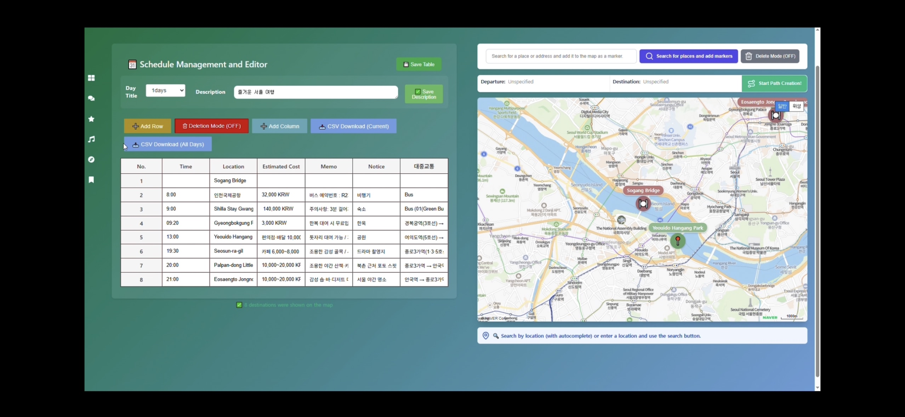
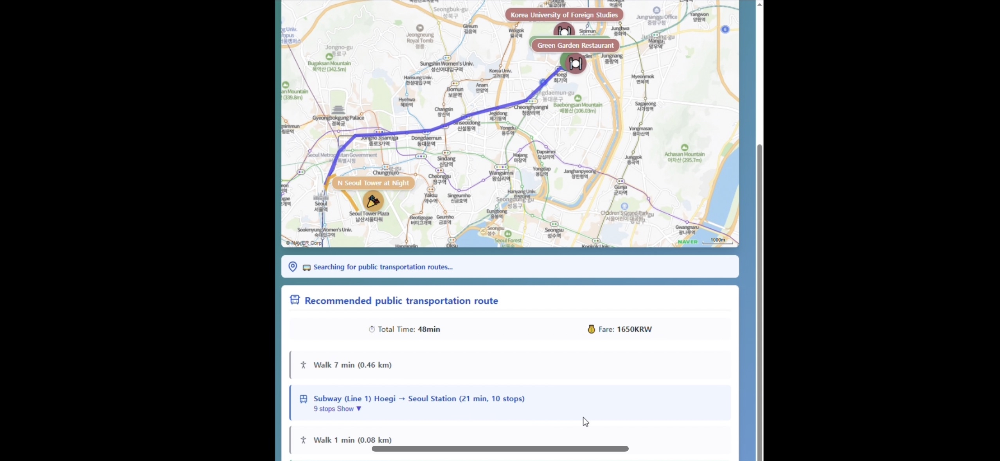

# ✈ K-Guidance: 외국인을 위한 K-여행 가이드 서비스

> **저장소 주소:** https://github.com/damdam1219/KGuidance.git
> 
> **주최: [LG U+] Why Not SW Camp 7기**
> 
> **프로젝트 기간:** 2025.05.13 ~ 2025.11.21  
>  
> **세부 과정명: 클라우드 빅데이터 분석 & 실무 기반 서비스 개발 과정**

---

## 🖤 짱구같은 팀원소개 🖤
<table>
<tr>
  <td align="center">
    👉 <a href="https://github.com/damdam1219" target="_blank">
      <b>김다은(팀장)</b>
    </a>
  </td>
  <td align="center">
    👉 <a href="https://github.com/tmdstart" target="_blank">
      <b>백승범(팀원)</b>
    </a>
  </td>
  <td align="center">
    👉 <a href="https://github.com/meanresult" target="_blank">
      <b>한지훈(팀원)</b>
    </a>
  </td>
</tr>
  <tr>
    <td align="center"></td>
    <td align="center"></td>
    <td align="center"></td>
  </tr>
  <tr>
    <td><b>역할:</b> 프론트엔드 개발/ UI·UX 기획</td>
    <td><b>역할:</b> 백엔드 개발/ API 설계</td>
    <td><b>역할:</b> 데이터베이스 관리 및 연동</td>
  </tr>
  <tr>
    <td><b>주요 기여:</b> 화면 설계, React 구조 구축, 지도·사용자 일정 플래너 설계</td>
    <td><b>주요 기여:</b> LLM 연동, 챗봇 개발, Qdrant 백엔드 구현, 배포 환경 구축</td>
    <td><b>주요 기여:</b> 데이터 수집 및 정제, 추천시스템 개발, Maria DB 데이터 설계</td>
  </tr>
</table>

---

## 💡 프로젝트 개요 (Project Overview)

K-Guidance는 **💜 K-contnet 💙를 중심으로 외국인 관광객들이 쉽고 간편하게 한국 여행을 계획하고 즐길 수 있도록 돕기 위해 개발된 맞춤형 K-여행 플래너 웹 서비스**입니다.

### 🔥 주요 기능 소개

---

<table>
  <tr>
    <!-- 좌측 이미지 -->
    <td width="50%">
      
      
    </td>
    <!-- 우측 설명 -->
    <td width="50%" valign="top">
      <h4>1. K-Content 기반 챗봇 – 맞춤형 여행지 추천</h4>
      
📌 사용자 선호 데이터를 기반으로 한 맞춤형 서울 여행지 추천 서비스

      <ul>
        <li>사용자의 관심사·선호도 분석을 통한 추천</li>
        <li><b>K-콘텐츠 기반 추천 제공</b>
          <ul>
            <li>🎵 K-pop 엔터테인먼트 스팟</li>
            <li>🍽️ 연예인 인기 맛집</li>
            <li>🎬 K-Drama 촬영지</li>
          </ul>
        </li>
        <li>RAG 모델로 컨텍스트 반영</li>
      </ul>
      
🛠 <b>기술 스택:</b> Qdrant 벡터 검색, RAG 기반 컨텍스트 추천 모델

    </td>
  </tr>
</table>

---

<table>
  <tr>
    <td width="50%">
      
      
    </td>
    <td width="50%" valign="top">
      <h4>2. K-Media 추천 시스템 – 한국 드라마 촬영지 기반 추천</h4>
      
📌 사용자가 좋아요(🧡)한 콘텐츠 기반으로 촬영지를 추천하는 개인화 시스템

      <ul>
        <li>컨텐츠에 🧡 클릭 → 자동 북마크</li>
        <li>북마크된 콘텐츠 기반 <b>개인 맞춤 촬영지 추천</b></li>
        <li>사용자 취향을 반영한 추천 근거까지 도출</li>
      </ul>
      
✨ <b>차별점:</b> 생각지도 못한 장소를 발견하는 서프라이즈 추천 시스템

      
🛠 <b>기술 스택:</b> Qdrant 벡터 검색, RAG 기반 추천 근거 생성 모델

    </td>
  </tr>
</table>

---

<table>
  <tr>
    <td width="50%">
      
      
    </td>
    <td width="50%" valign="top">
      <h4>3. 사용자 일정 플래너 – 직관적인 일정 수정/관리 UI</h4>
      
📌 여행 일정 생성 → 지도 확인 → 대중교통 안내까지 한 번에 가능

      <ul>
        <li>초보자도 쉽게 사용할 수 있는 직관적 일정 테이블</li>
        <li><b>지도 연동</b>으로 목적지 위치 실시간 확인</li>
        <li>대중교통(이동 경로) 자동 제공</li>
      </ul>
      
✨ <b>차별점:</b> 일정 확인/수정/삭제가 한 화면에서 모두 가능, 지도+목적지 리스트+일정 테이블 통합

      
🛠 <b>기술 스택:</b> Google API(검색), Naver Map API(영문 지도), Odsay API(대중교통·환승)

    </td>
  </tr>
</table>

---

## 📚 프로젝트 문서 및 산출물

주요 기획 및 설계 문서를 링크합니다. (파일이 업로드된 경우)

* **프로젝트 기획서:** [링크]
* **WBS (작업 분할 구조):** [링크]
* **프로젝트 계획서:** [링크]

## 🏗️ 시스템 아키텍처 (System Architecture)

* **[개념 설명]:** [데이터 수집, 처리, 서비스 제공에 이르는 전체적인 파이프라인 설명]
## 🛠️ 기술 스택 (Tech Stack)

이 프로젝트는 안정적인 서비스 제공과 효율적인 데이터 처리를 위해 다음과 같은 기술 스택으로 구성되었습니다.

### ☁️ 인프라 및 배포 (Infrastructure & Deployment)
| 구분 | 기술 스택 | 설명 |
| :--- | :--- | :--- |
| **클라우드** | **Amazon EC2 (AWS)** | 서버를 호스팅하고 운영하기 위한 클라우드 컴퓨팅 서비스 |
| **운영체제** | **Ubuntu** | EC2 인스턴스에 설치된 리눅스 운영체제 |
| **가상화** | **Docker** | 프론트엔드와 백엔드 환경을 컨테이너로 분리 및 배포 |

---

### 💻 애플리케이션 (Application)

| 구분 | 역할 | 기술 스택 |
| :--- | :--- | :--- |
| **프론트엔드 (Frontend)** | 사용자 인터페이스 구축 | **React**, **Node.js** |
| **백엔드 (Backend)** | 핵심 비즈니스 로직 및 API 서버 | **FastAPI** (Python) |

---

### 💾 데이터베이스 및 데이터 처리 (Database & Data Processing)

#### 데이터베이스
| 구분 | 기술 스택 | 설명 |
| :--- | :--- | :--- |
| **관계형 DB** | **MariaDB** | 정형화된 데이터 저장 및 관리 |
| **벡터 DB** | **Drant** | AI/검색 기능에 필요한 벡터 데이터의 효율적인 저장 및 검색 |

#### 데이터 수집 도구
| 기술 스택 | 역할 |
| :--- | :--- |
| **BeautifulSoup** | HTML/XML 파싱 및 정적 웹 크롤링 |
| **Playwright** | 동적 웹사이트 크롤링 및 자동화 |
| **pandas** | 수집된 데이터의 가공 및 분석 |

---

### 🌐 외부 연동 API (External APIs)
시스템의 기능을 확장하고 다양한 정보를 제공하기 위해 아래의 외부 API들을 연동하였습니다.

* **OpenAI:** AI 기반의 자연어 처리 및 콘텐츠 생성 기능
* **NAVER:** 검색, 지도, 번역 등 네이버 서비스 연동
* **Google:** 지도, 검색 등 구글 서비스 연동
* **ODSay:** 대중교통 경로 탐색 및 길 찾기 기능

## 📁 디렉토리 구조 및 역할

| 디렉토리 명 | 주요 역할 | 상세 설명 |
| :--- | :--- | :--- |
| **`crawling`** | **데이터 크롤링 파일** | 여행 관련 웹사이트 및 소스에서 **원천 데이터를 수집**하는 파이썬 스크립트 및 설정 파일입니다. |
| **`docs`** | **프론트엔드 그림 파일** | 프로젝트의 웹 또는 앱 **프론트엔드**에서 사용되는 **이미지, 아이콘, 로고** 등 시각적 리소스 파일을 포함합니다. |
| **`ktravel_data`** | **벡터DB 연동 파일** | 크롤링된 데이터를 정제하고, 효율적인 검색을 위해 **벡터 데이터베이스(Vector DB)**에 데이터를 저장하고 연동하는 로직이 포함되어 있습니다. |
| **`wh07-3rd-kguidence`** | **핵심 개발 코드** | 프로젝트의 **실제 비즈니스 로직** 및 백엔드 서버 구축에 사용된 **핵심 개발 코드**가 위치합니다. |

---

## 💭 프로젝트 회고 (Retrospective)

### 1. 성공 요인

* [성공 요인 1]
* [성공 요인 2]

### 2. 어려웠던 점 및 극복 과정

* [어려웠던 기술적 난관 및 해결 과정]
* [팀원 간의 의견 충돌 및 조율 과정]

### 3. 배운 점 및 향후 계획

* [이 프로젝트를 통해 개인/팀이 배운 핵심 지식]
* [향후 서비스 발전 방향 또는 개선할 부분]
